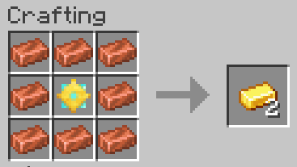
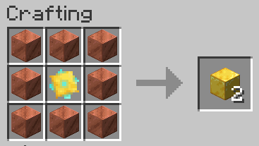
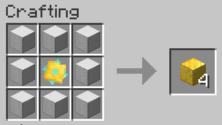
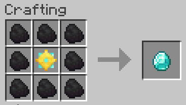
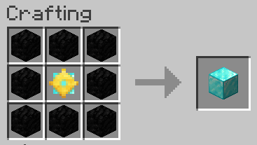

# Philosopher's stone (Fabric and NeoForge)

The philosopher's stone is a legendary  alchemical substance capable of turning base metals such as copper or iron into gold. It is also called the elixir of life, useful for rejuvenation and for achieving immortality. For many centuries, it was the most sought-after goal in alchemy. 

In Minecraft, after years of research, I discovered its secret recipe:

The potion in the center is the Potion of Healing. It is the only potion that works.

Legends always have a gist of truth, but they rarely tell the whole truth, so I tested the capabilities of the newly discovered philosopher's stone, and this is what I found:

- It can only be found, and craftable, in worlds where this mod is installed,
- Its recipes are kept in secret, and do not appear in REI or in any recipe book,
- I was unable to test if it helps to achieve immortality, because in Minecraft every player is immortal,
- However, it does not make the player immortal in hardcore mode,
- It has some healing property, if it is kept in the player's inventory,
- When used on certain animals, it makes them juvenile,
- It does not work on horses, villagers and hostile mobs,
- It does turn copper into gold

 

- And it does turn iron into gold

 

- But its most magical property is that it turns coal into diamond

 

- There might be other, similar recipes, I am not sure, I have found them all,
- And finally, quite sadly, it has a limited use, because it gets damaged after every use.

## License

Standard MIT license. Feel free to learn from it and incorporate it in your own projects.

## Source code

Available on [GitLab](https://gitlab.com/pintergabor/philosopherstone.git) or on [GitHub](https://github.com/pinter-gabor-at/philosopherstone.git).

## For developers

Quite often, when I start learning programming on a new platform, I find even the simplest examples too complicated.
Tutorials, written by experts, with years of experience programming on that platform, sometimes forget how difficult those first step are.
This is why I decided to make my first Minecraft mods publicly available, and document the source code meticulously.

## See also

My other mods on [Modrinth](https://modrinth.com/user/pinter.gabor) and on [CurseForge](https://www.curseforge.com/members/pintergabor/projects).
